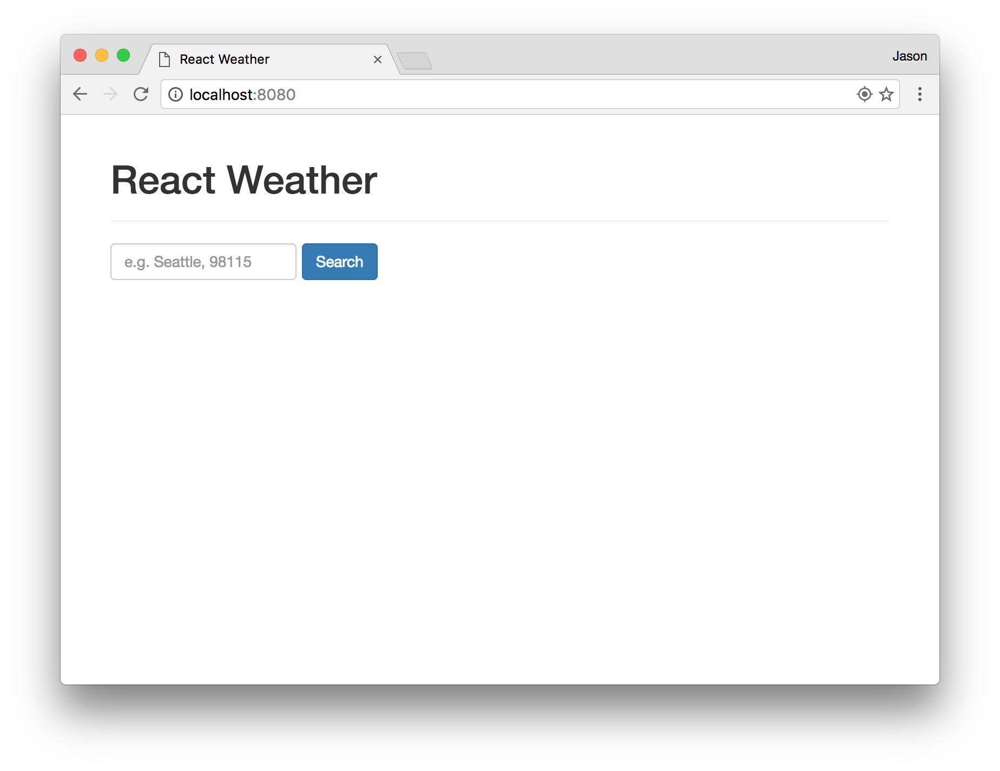
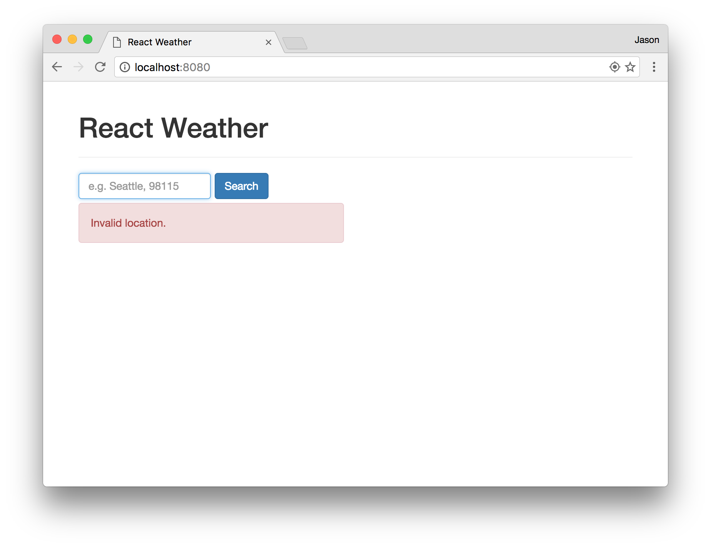
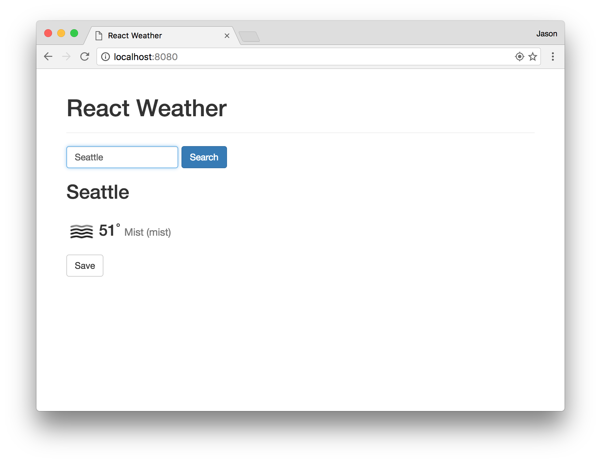
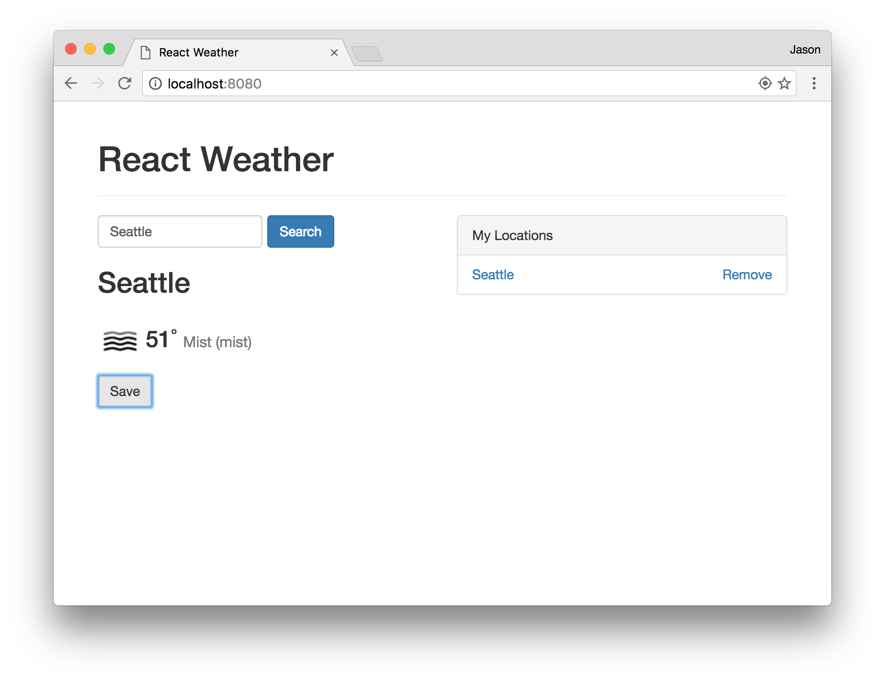
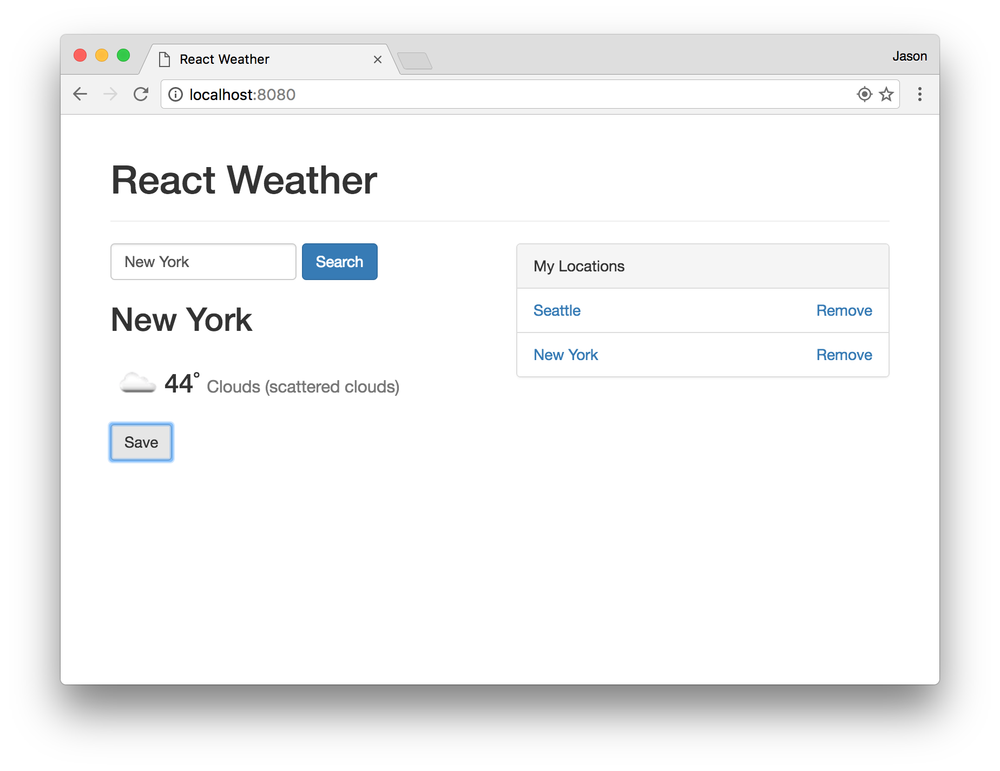
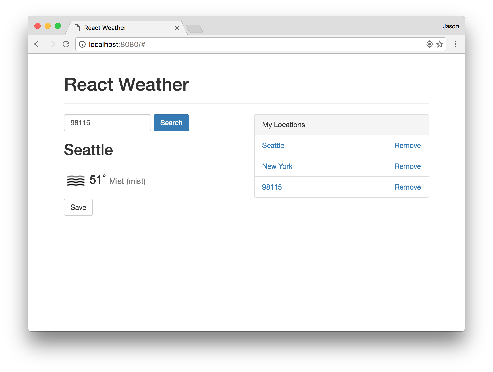
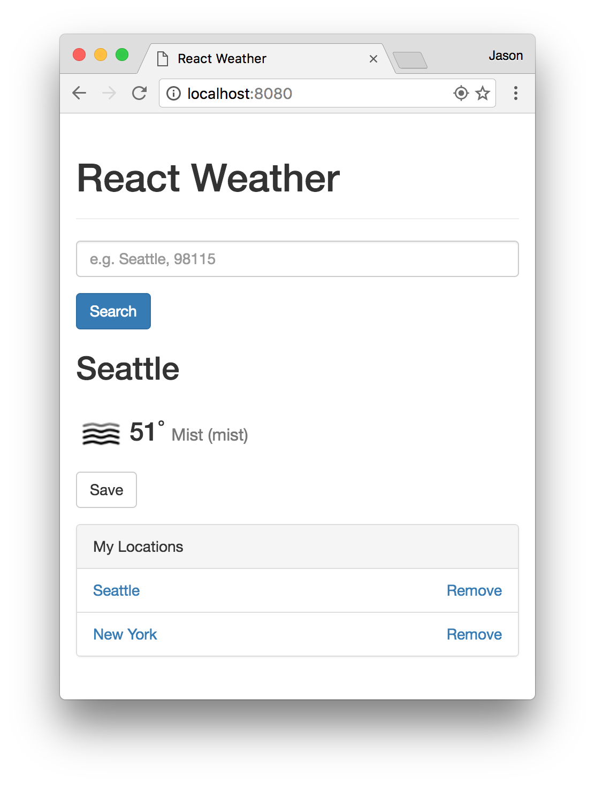

# Challenge 5 - Data fetching

For this challenge, you will combine your knowledge of HTML, CSS, and JavaScript to build a simple weather application.

## Resources

* <a href="https://openweathermap.org/" target="_blank">Open Weather Map</a>
    * <a href="https://openweathermap.org/current" target="_blank">Current Weather API</a>
    * <a href="https://openweathermap.org/weather-conditions" target="_blank">Weather Conditions</a>
* <a href="https://developers.google.com/web/updates/2015/03/introduction-to-fetch" target="_blank">fetch</a>
* <a href="https://developer.mozilla.org/en-US/docs/Web/API/Web_Storage_API/Using_the_Web_Storage_API" target="_blank">localStorage</a>

## Setup

### Install Node and live-server

When working on this challenge, you will need to run a local http server in order to use the `fetch` API. For this challenge, you will use `live-server`, a simple http server you can run locally on your computer.

1. Download Node.js: <a href="https://nodejs.org/en/" target="_blank">https://nodejs.org/en/</a>
2. To verify it is installed correctly, open a command line / terminal and run: `node --version`
3. To install `live-server`, run this command: `npm install -g live-server`
4. If you are on a Mac and receive a permissions error, try this command instead: `sudo npm install -g live-server`. If you receive
5. To start your server, change directories to the root of your challenges repo and run `live-server` with your `challenge5` folder: `live-server challenge5`.
6. Your `index.html` file will automatically open in your web browser.
7. When you make changes to your files, `live-server` will automatically refresh your browser.

### Update your challenge repo

Please perform the following steps in your challenges repo (on your personal machine) to update your repo and pull down the latest starter code.

1. First, verify you have no uncommitted changes: `git status`
2. Switch back to your `master` branch: `git checkout master`
3. Pull the latest code into your `master` branch: `git pull origin master`
4. Only if you have not done so on your current computer already, you will need to connect your challenges repo to the main challenges repo. To do so, perform this command (you only need to perform this command once for each computer): `git remote add upstream https://github.com/info340c-au19/challenges.git`
5. Create a new branch for this challenge: `git checkout -b challenge5`
6. Now update your repo with the new starter code for this challenge. To do so, perform this command (you will need to perform this command once each week when a new challenge is posted): `git pull upstream master`
7. If you receive a permissions error, please check your email for an invite to the organization, and accept the invite. If you cannot find the invite, please contact the teaching team immediately.
8. If you encounter a merge conflict, you will need to resolve the merge conflict before you can start. Please contact the teaching team if you need help.
9. You can now push this new branch to Github: `git push origin challenge5`

### Open Weather Map API Key

To obtain an API key for Open Weather Map, perform the following steps:

1. Go to <a href="https://openweathermap.org/" target="_blank">https://openweathermap.org/</a>
2. Click Sign Up.
3. You will be presented with a modal to provide your company name and purpose. You can put "University of Washington" and select the Education option.
4. To generate an API key, go to the <a href="https://home.openweathermap.org/api_keys" target="_blank">API Keys</a> tab.
5. You will need to include this API key with each request you make to their API.
6. Documentation on the current weather API can be found at <a href="http://openweathermap.org/current" target="_blank">http://openweathermap.org/current</a>

## Requirements

For this assignment, the overall look and feel of your application is up to you, however, the functionality must satisfy the following requirements:

**A. Look / Feel**

1. Your application must work correctly on both small and large screens (from 320px to 1200px, at least).
2. It should be styled with more than just the default browser styling. It is recommended to use a CSS Framework such as Bootstrap.
3. Regardless of which CSS Framework you use, your app must have a consistent and appealing look and feel.

**B. Hosting**

1. Any data from for your app must be stored in the browser's `localStorage`.
2. Your page should be hosted on Github Pages.

**C. Weather Page**

1. The page must display the name of your weather app at the top of the page and in the title of the browser tab.
2. There must be an input box where a user can search for a location by postal code or city name.
3. When the user submits a location search, your app must retrieve the current weather about that location from the <a href="https://openweathermap.org/current" target="_blank">openweathermap.org API</a>.
4. If the user provides a location that doesn't exist, or the openweathermap.org API returns any other error when searching for the city, you must show an error to the user (e.g. "Invalid location").
5. The page must show **at least** the following information about the weather:
    1. The name of the location (e.g. if the user enters "98115", it must show "Seattle").
    2. The "short" and "long" description of the current weather. (e.g. "Clouds" and "scattered clouds"). **Note:** The weather API may return multiple weather conditions for a given location. You only need to display the first weather condition, if so.
    3. An <a href="https://openweathermap.org/weather-conditions" target="_blank">icon</a> for the current conditions.
    4. The temperature in Fahrenheit (with no decimal places).
    5. A button to Save that location to their saved locations.
6. When the user clicks the button to save the current location, the query the user provided for that location must be saved in a list of locations, and that list of locations must be visible to the user on the page.
7. The current list of saved locations must be saved to the browser's `localStorage`.
8. When the user clicks a previously saved location, the page must show the current weather for that location.
9. The user must have the ability to remove a location from the saved locations list.
10. If the user refreshes their page (or closes their browser and reopens your app), the page must show the previously saved locations.
11. Users should not be able to save queries that are invalid (i.e. an error was returned when searching for the location).
12. When the page first loads, if the user has any saved locations, the page should show the weather for the first location in the list.

## Screenshots

Below are screenshots of a sample solution that satisfies all of the functional requirements above. You can use this as a starting point, but I recommend trying to make something that looks even better. 

**Initial Page Load (no saved locations)**

**Search Error**

**Weather for Seattle**

**Seattle saved to My Locations**

**New York saved to My Locations**

**98115 saved to My Locations**

**Mobile view**

### Third-party libraries

While you may use the CSS from Bootstrap, you may not use Bootstrap's JavaScript, or any other third-party JavaScript library such as jQuery.

### Validate your code

#### HTML
Use the <a href="https://validator.w3.org/#validate_by_upload" target="_blank">HTML Validation Service</a> to validate your HTML and fix any errors or warnings that are reported. The report should contain specific instructions and/or links that will help you fix the problems.

#### CSS
Also use the <a href="http://jigsaw.w3.org/css-validator/#validate_by_upload" target="_blank">CSS Validation Service</a> to validate your CSS and fix any errors or warnings that are reported.

#### JavaScript

Use <a href="https://jshint.com" target="_blank">JSHint</a> to validate your JavaScript. You should fix all warnings or errors that are reported, with the exception of ES6-related warnings. You can turn these off by clicking "configure" at the top and checking the box for "New JavaScript features (ES6)".

**We will run your HTML, CSS, and JS through these validators and you will lose points if any errors/warning are reported!**

## How to Submit your Assignment 

All code for this challenge must be committed to the **challenge5** branch in your repo. Push this branch to Github, open a pull request to your **master** branch (do not merge it yourself), and then submit the URL to your pull request on Canvas. In the description of your pull request, please include a link to your app on Github Pages, and please list any extra credit options you completed.

## Extra Credit

* **Styling** (5 points max): Style your app with more than just the default styling for your CSS framework.
* **Additional Data** (5 points max): In addition to the basic weather data, using the OWM API to display more information about the current weather in an informative, useful, and pleasing way.
* **User preferences** (5 points): Provide controls for the user to change their preferences (e.g. changing from temperature imperial units to metric units). These preferences must also persist between sessions.
* **Current location** (5 points): Provide a button the user can click to load the weather data for their current location.
